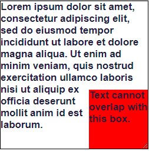

# Getting Started with Create React App

This project was bootstrapped with [Create React App](https://github.com/facebook/create-react-app).

## Available Scripts

In the project directory, you can run:

### `npm start`

Runs the app in the development mode.\
Open [http://localhost:3000](http://localhost:3000) to view it in your browser.

The page will reload when you make changes.\
You may also see any lint errors in the console.

### `npm test`

Launches the test runner in the interactive watch mode.\
See the section about [running tests](https://facebook.github.io/create-react-app/docs/running-tests) for more information.

### `npm run build`

Builds the app for production to the `build` folder.\
It correctly bundles React in production mode and optimizes the build for the best performance.

The build is minified and the filenames include the hashes.\
Your app is ready to be deployed!

See the section about [deployment](https://facebook.github.io/create-react-app/docs/deployment) for more information.

### `Task`

in this HTML and CSS challenge, your task is to reproduce this nested layout:

Specifically, position a box of red text nested in the bottom-right corner of a text-filled container. The text in the larger container should flow around the box. We'll use the size (in pixels) of 100*100 for the small box and 250*250 for the large box.

### `Rubric`
The rubric for the challenge is as follows:
- Does the solution correctly match the provided visual specification as validated by the testing suite?

-Is the solution code clean? Specifically, are class and id names consistently and descriptively named following a standard convention?

### `brief description of my approach`

We’ll need a container element to contain everything, and we’ll be using flexbox on it.
Flexbox allows us to rely on the
default stretch alignment to be able to later use height: 100%.
The `.wrapper` within the `.container` is our flex item. We don’t need any particular CSS applied to the `wrapper`. It defines the height of the container and, at the same time, is stretched to the same height. This behavior will give us a “reference height” that can be used by the child elements.
If the flex item has align-self: stretch, redo layout for its contents, treating this used size as its definite cross size so that percentage-sized children can be resolved.
The keyword is the definite which allows us to safely use a percentage (%) height inside the box element.
Now for the floated element:
Our `.float` element will take the entire height next to the text content, thanks to the height calculation we detailed above. Inside this element we push the red box to the bottom using flexbox alignment.
Now for the real trickery, using the `shape-outside` property. Here’s how MDN defines it:
-"The shape-outside CSS property defines a shape—which may be non-rectangular—around which adjacent inline content should wrap. By default, inline content wraps around its margin box; shape-outside provides a way to customize this wrapping, making it possible to wrap text around complex objects rather than simple boxes."-
In other words, shape-outside sets the way content flows around an element’s bounding box.

It takes a number of values. One of those is the inset() function which, again, according to MDN:
-"Defines an inset rectangle. When all of the first four arguments are supplied they represent the top, right, bottom and left offsets from the reference box inward that define the positions of the edges of the inset rectangle."-
So, with shape-outside: inset(calc(100% - X) 0 0) we can create an inset rectangle that starts exactly at the top of the red box. And the top is equal to 100% - X, where X is the red box height and 100% is the height of the .float element. This allows the text to wrap within the free space on the top of the red box. This is responsive, plus we can easily switch between left and right (by adjusting the float property)

That’s it! The only major caveat is that you need to know the red box height (100px).
